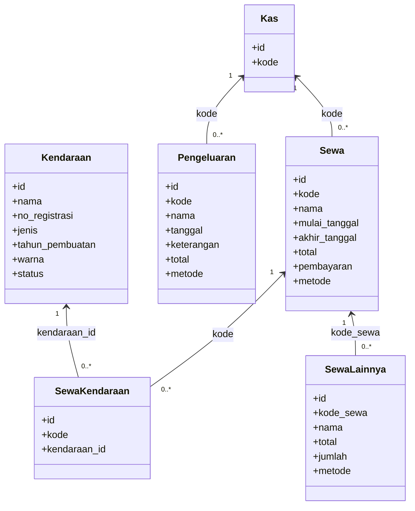

<div align="center">

# 🚗 Akar Sewa Transportasi

**Sistem Manajemen Sewa Kendaraan berbasis Web**

> Aplikasi full-stack untuk mengelola armada kendaraan, transaksi sewa, pengeluaran, dan arus kas usaha transportasi — dibangun dengan Laravel 10 & React (Inertia.js).

[](https://laravel.com)
[](https://react.dev)
[](https://inertiajs.com)
[](https://tailwindcss.com)
[](https://www.php.net)
[](LICENSE)

</div>

---

## 📌 Tentang Proyek

**Akar Sewa Transportasi** adalah aplikasi manajemen operasional berbasis web yang dirancang untuk membantu usaha sewa kendaraan dalam:

- Mengelola **armada kendaraan** secara terpusat
- Mencatat dan melacak **transaksi sewa** dengan detail
- Memantau **pengeluaran** dan **arus kas** usaha
- Mengatur akses pengguna berdasarkan **level (Pegawai / Owner)**

Repositori ini **terbuka untuk publik** — bebas digunakan, dipelajari, dan dikembangkan lebih lanjut.

---

## 🛠️ Tech Stack

| Layer | Teknologi |
|---|---|
| **Backend** | PHP 8.1+, Laravel 10, Laravel Sanctum |
| **Frontend** | React 18, Inertia.js, Tailwind CSS |
| **Build Tool** | Vite 5 |
| **Database** | MySQL / MariaDB |
| **Auth** | Laravel Breeze |
| **Utilities** | react-toastify, react-datepicker, react-to-print, Yup, Ziggy |

---

## ✨ Fitur Utama

- 🔐 **Autentikasi & Otorisasi** — Login dengan dua level akses: `Pegawai` dan `Owner`
- 🚘 **Manajemen Kendaraan** — CRUD kendaraan lengkap (nama, nomor registrasi, jenis, tahun, warna, status)
- �� **Transaksi Sewa** — Pembuatan transaksi sewa dengan pemilihan kendaraan, metode pembayaran, tanggal mulai & selesai
- 💸 **Pencatatan Pengeluaran** — Catat pengeluaran operasional dengan keterangan dan metode pembayaran
- 💰 **Manajemen Kas** — Entitas `kas` terpusat yang terhubung ke transaksi sewa dan pengeluaran
- 🖨️ **Cetak Laporan** — Ekspor/cetak laporan transaksi langsung dari browser
- 🌱 **Data Seeder** — Data dummy siap pakai untuk keperluan pengujian dan demonstrasi

---

## 🗄️ Struktur Database

| Tabel | Kolom Utama |
|---|---|
| `users` | id, name, email, level, password |
| `kas` | id, kode *(unique)* |
| `kendaraans` | id, nama, no_registrasi, jenis, tahun_pembuatan, warna, status |
| `sewa` | id, kode, nama, mulai_tanggal, akhir_tanggal, total, pembayaran, metode |
| `pengeluarans` | id, kode, nama, tanggal, keterangan, total, metode |
| `sewa_kendaraans` | id, kode *(→ sewa)*, kendaraan_id *(→ kendaraans)* |
| `sewa_lainnya` | id, kode_sewa *(→ sewa)*, nama, total, jumlah, metode |

> Detail lengkap setiap kolom tersedia di `database/migrations/`.

---

## 🔗 Diagram Relasi (Class Diagram)



---

## 🚀 Cara Menjalankan

### Prasyarat

- PHP >= 8.1
- Composer
- Node.js + npm
- MySQL / MariaDB
- *(Opsional)* [Laragon](https://laragon.org) untuk Windows (disarankan)

### Langkah Instalasi

```bash
# 1. Clone repositori
git clone https://github.com/hndko/app_akarsewatransportasi_laravel10.git
cd app_akarsewatransportasi_laravel10

# 2. Instal dependensi PHP
composer install

# 3. Instal dependensi Node
npm install

# 4. Salin file environment
cp .env.example .env        # Linux/Mac
copy .env.example .env      # Windows

# 5. Generate application key
php artisan key:generate
```

Edit `.env` dan sesuaikan konfigurasi database:

```env
DB_CONNECTION=mysql
DB_HOST=127.0.0.1
DB_PORT=3306
DB_DATABASE=akar_transportasi
DB_USERNAME=root
DB_PASSWORD=
```

```bash
# 6. Jalankan migrasi dan seeder
php artisan migrate --seed

# 7. Build asset frontend (development)
npm run dev

# 8. Jalankan server lokal
php artisan serve
```

Aplikasi berjalan di **[http://127.0.0.1:8000](http://127.0.0.1:8000)**

---

## 👤 Akun Demo

| Role | Email | Password |
|---|---|---|
| Pegawai / Owner | `budi.santoso@example.com` | `password` |

> ⚠️ Ubah kredensial default sebelum digunakan di lingkungan produksi.

---

## 📁 Struktur Proyek (Ringkasan)

```
├── app/
│   ├── Http/Controllers/   # Controller untuk setiap modul
│   ├── Models/             # Kas, Kendaraan, Sewa, Pengeluaran, dll.
│   └── Providers/
├── database/
│   ├── migrations/         # Skema database
│   └── seeders/            # Data contoh
├── resources/
│   └── js/                 # Komponen React & halaman Inertia
├── routes/
│   └── web.php             # Definisi rute aplikasi
└── public/
```

---

## 📄 Lisensi

Proyek ini dilisensikan di bawah [MIT License](LICENSE). Bebas digunakan, dimodifikasi, dan didistribusikan dengan tetap mencantumkan atribusi.

---

<div align="center">
  <sub>Dibuat dengan ❤️ menggunakan Laravel & React</sub>
</div>
