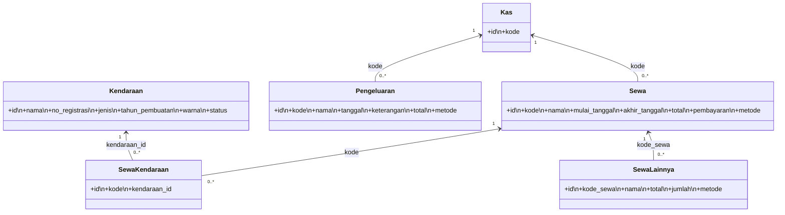

**Web Akar Transportasi**

Versi singkat: Sistem manajemen sewa kendaraan sederhana berbasis Laravel — mencakup manajemen kendaraan, transaksi sewa, pengeluaran, dan kas. Repositori ini DIBUKA UNTUK PUBLIK; siap diambil, dipakai, dan dikembangkan ulang oleh siapa saja.

**Daftar Isi**

- **Deskripsi Proyek**
- **Fitur**
- **Struktur Database (ringkasan)**
- **UML (diagram kelas)**
- **Cara Menjalankan (Running)**
- **Seeder & Data Contoh**
- **Lisensi**

**Deskripsi Proyek**

- Proyek ini adalah aplikasi backend/admin sederhana untuk pengelolaan sewa kendaraan dan kas usaha. Dibangun menggunakan Laravel (PHP) dengan struktur model: `Kas`, `Sewa`, `Pengeluaran`, `Kendaraan`, `SewaKendaraan`, `SewaLainnya` dan `User`.

**Fitur**

- **Autentikasi pengguna**: level pengguna (`Pegawai`, `Owner`).
- **Manajemen Kendaraan**: tambah/ubah/hapus kendaraan (nama, no registrasi, jenis, tahun, warna, status).
- **Transaksi Sewa**: buat transaksi sewa, pilih kendaraan terkait, metode pembayaran, tanggal mulai/akhir.
- **Pengeluaran**: pencatatan pengeluaran kas dengan keterangan dan metode pembayaran.
- **Kas**: entitas `kas` yang terhubung ke transaksi sewa dan pengeluaran lewat `kode`.
- **Seeder data contoh**: data dummy untuk mempermudah pengujian.

**Struktur Database (ringkasan tabel utama)**

- `users` — `id, name, email, email_verified_at, level, password, remember_token, timestamps`
- `kas` — `id, kode(unique), timestamps`
- `kendaraans` — `id, nama, no_registrasi(unique), jenis, tahun_pembuatan, warna, status, timestamps`
- `sewa` — `id, kode(unique), nama, mulai_tanggal, akhir_tanggal, total, pembayaran, metode, timestamps` (kolom `kode` merefer ke `kas.kode`)
- `pengeluarans` — `id, kode(unique), nama, tanggal, keterangan, total, metode, timestamps` (kolom `kode` merefer ke `kas.kode`)
- `sewa_kendaraans` — `id, kode, kendaraan_id, timestamps` (relasi ke `sewa.kode` dan `kendaraans.id`)
- `sewa_lainnya` — `id, kode_sewa, nama, total, jumlah, metode, timestamps` (relasi ke `sewa.kode`)

Jika butuh detail kolom lengkap, lihat migrasi di `database/migrations/`.

**UML (Diagram Kelas — Mermaid)**



**Cara Menjalankan (Quickstart)**
Persyaratan: `PHP >= 8.x`, `Composer`, `Node.js` + `npm`/`yarn`, dan database MySQL/MariaDB. Di Windows, aplikasi ini sudah siap dijalankan di Laragon.

Langkah singkat:

1. Clone repositori:

```bash
git clone <repo-url>
cd web_akar_transportasi
```

2. Instal dependensi PHP dan Node:

```bash
composer install
npm install
```

3. Salin berkas lingkungan dan atur konfigurasi database di `.env`:

```bash
copy .env.example .env    # Windows
php artisan key:generate
```

Edit `.env` lalu atur `DB_CONNECTION`, `DB_HOST`, `DB_PORT`, `DB_DATABASE`, `DB_USERNAME`, `DB_PASSWORD`.

4. Migrasi dan seed data contoh:

```bash
php artisan migrate --seed
```

5. Jalankan asset build (development):

```bash
npm run dev
```

6. Jalankan server lokal:

```bash
php artisan serve
# atau gunakan Laragon untuk environment Windows (lebih mudah)
```

Endpoint web berada di `http://127.0.0.1:8000` secara default.

**Seeder & Data Contoh**

- `database/seeders/DatabaseSeeder.php` sudah menyediakan data contoh untuk `users`, `kas`, `kendaraans`, `sewa`, `pengeluarans`, dan `sewa_kendaraans`.
- Akun contoh: `budi.santoso@example.com` dan password default `password` (harus diubah di produksi).

**Catatan Keamanan & Lisensi**

- Repositori ini terbuka untuk publik sesuai permintaan pemilik; pengguna lain bebas mengambil dan meneruskan proyek ini.
- Pastikan menghapus atau mengubah kredensial default sebelum dipakai di lingkungan produksi.
- Lisensi: sesuaikan dengan kebijakan Anda (belum ditentukan di repo ini). Jika ingin menggunakan MIT, tambahkan file `LICENSE`.

Jika Anda ingin saya menambahkan file `LICENSE`, contoh README bahasa Inggris, atau men-deploy ke Heroku/Vercel/Laragon, beri tahu saya.
